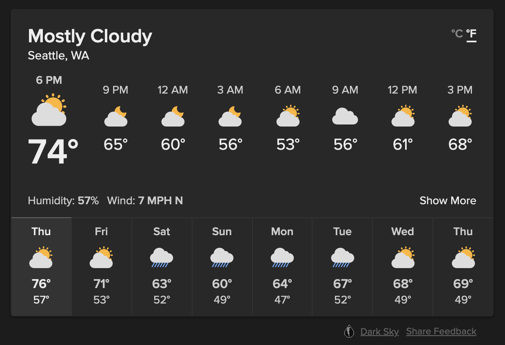
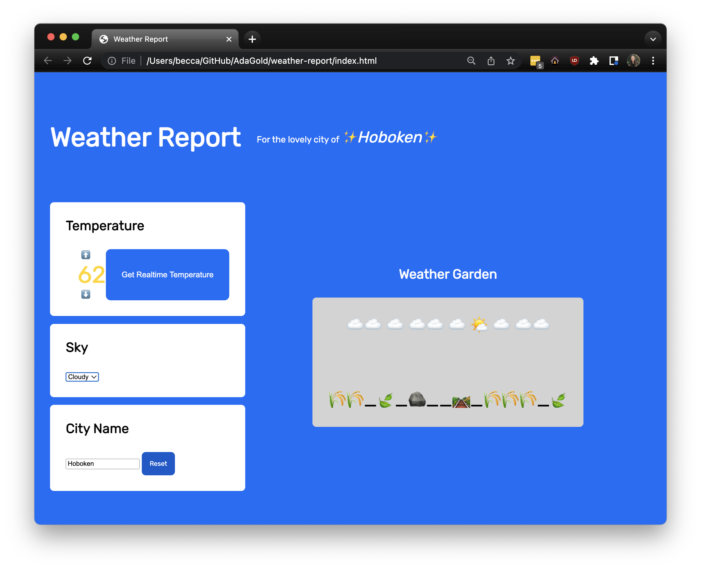
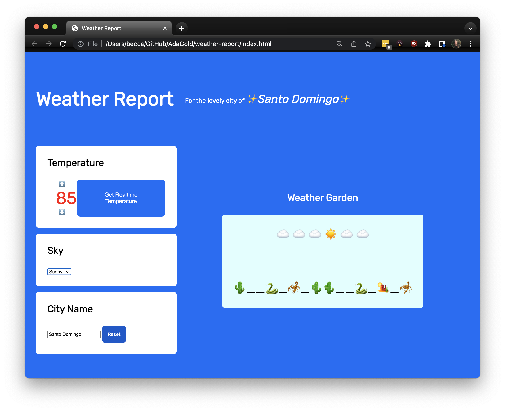
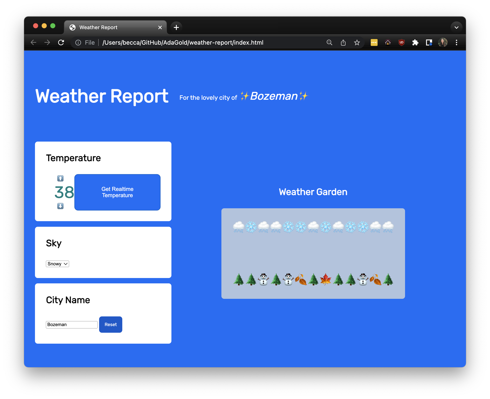
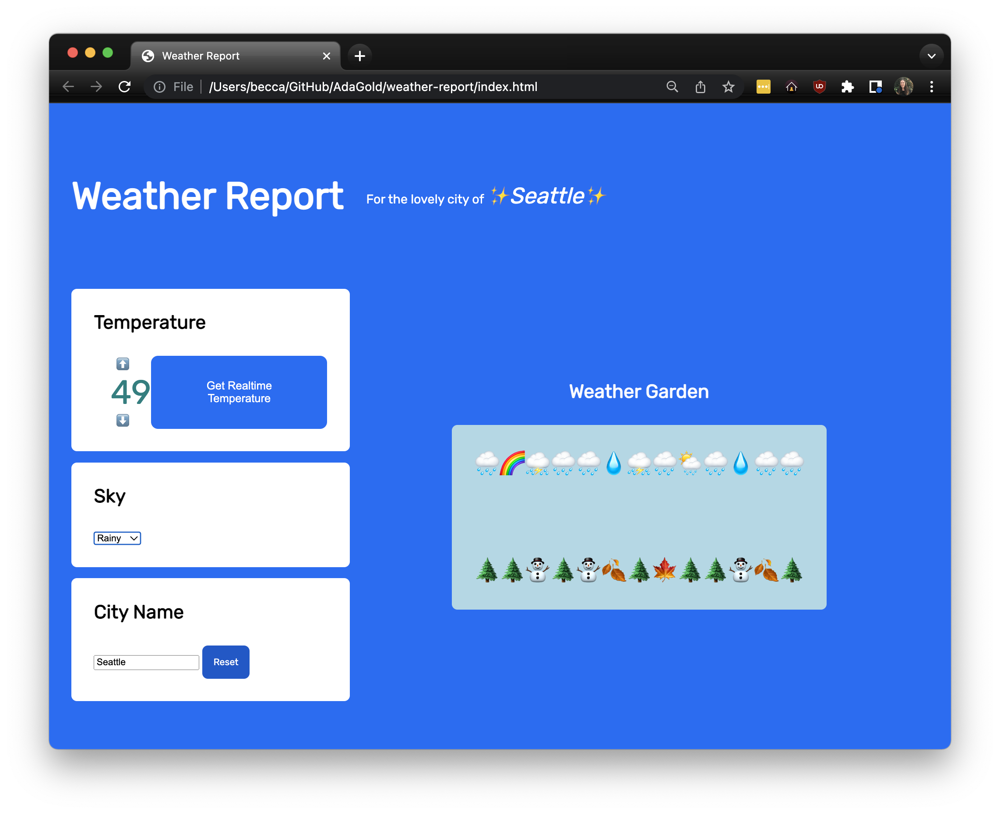

# Weather Report

## Skills Assessed

- Following directions and reading comprehension
- Structuring content in HTML
- Applying styles with CSS
- Using variables
- Creating functions
- Manipulating the DOM
- Handling events
- Using Git
- Designing an intentional user experience
- Using Axios to call 3rd party APIs
- Using a proxy server to manage API keys
- Handling asynchronous calls

## Goal

"Do I need to bring a jacket?" "Will it snow today?" "How hot will it be?" When we have questions like these, we often pull open a weather app!

Great weather apps do these two things:

1. Pull weather data from a data source
1. Display the weather in readable, compelling way

  
_Fig. DuckDuckGo's weather modal, which features city name, temperature reading, and weather icons._

Our goal is to create a fun, small weather app that focuses on displaying the weather.

Our weather app will set the weather using user interaction and get the weather from a 3rd party API, OpenWeather.

  
_Fig. Example weather app displaying the weather for Hoboken._

  
_Fig. Example weather app displaying the weather for Santo Domingo._

  
_Fig. Example weather app displaying the weather for Bozeman._

  
_Fig. Example weather app displaying the weather for Seattle._

## How to Complete and Submit

Follow the requirements below and build a small weather app.

At submission time, no matter where you are, submit the project via Learn.

## JavaScript Requirements

You are required to use vanilla JavaScript for all parts of this project, including the optional enhancements.

## Axios
The only extra JavaScript library we should load is [`Axios`](https://axios-http.com/docs/intro).

To download the `axios` node module, run `yarn install`

To include axios in your project, include the following script tag above the script tag linking `index.js`:
- ``

This should be done during the Wave 1 initial setup of your `index.html` page.

## Workflow Requirements

- Create at least five git commits throughout this project
- Use the following files and folders:
  - `index.html`
  - `src/index.js`
  - `styles/index.css`
  - `assets` folder, potentially for holding images
- Create and add more folders and files as needed

## Content Requirements

For this project, there are no requirements around color schemes, font choices, or layouts. 

Note that applying styles with CSS is one of many learning goals of this project -- it is not the central learning goal. You may enjoy being creative with styles, but we encourage you to not concern yourself with getting the styles perfect. Remember, you can always choose to continue working on styling after you've completed all functional requirements. 

However, _at a minimum_, your project must contain these elements:

Wave 2:

1. An element that displays the temperature
1. A clickable element to increase temperature
1. A clickable element to decrease temperature
1. An element that displays a landscape

Wave 3:

1. An element that displays the city name
1. An element that contains an `<input type="text">` element, used to rename the city

Wave 4:

1. A clickable element to get the current temperature of the displayed city name

Wave 5:

1. A `<select>` dropdown element to set the sky type
1. An element that displays a sky

Wave 6:

1. A clickable element to reset the city name

## Detailed Content Requirements

[Wave 1: Create Wireframes and HTML](./ada-project-docs/wave-01.md)

[Wave 2: Increase and Decrease Temperature](./ada-project-docs/wave-02.md)

[Wave 3: Naming the City](./ada-project-docs/wave-03.md)

[Wave 4: Calling APIs](./ada-project-docs/wave-04.md)

[Wave 5: Selecting the Sky](./ada-project-docs/wave-05.md)

[Wave 6: Resetting the City Name](./ada-project-docs/wave-06.md)

[Optional Enhancements to inspire you](./ada-project-docs/optional-enhancements.md)
