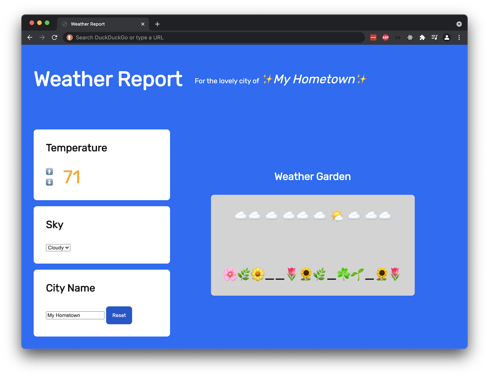
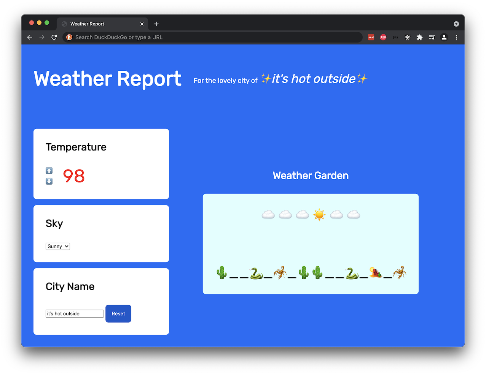
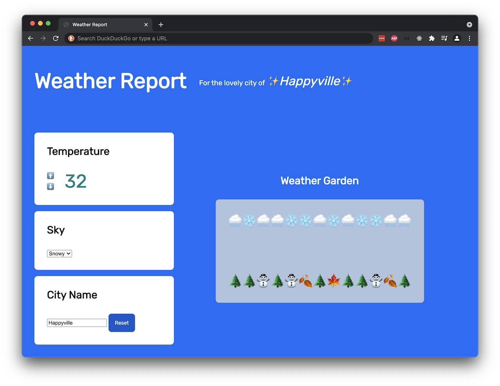
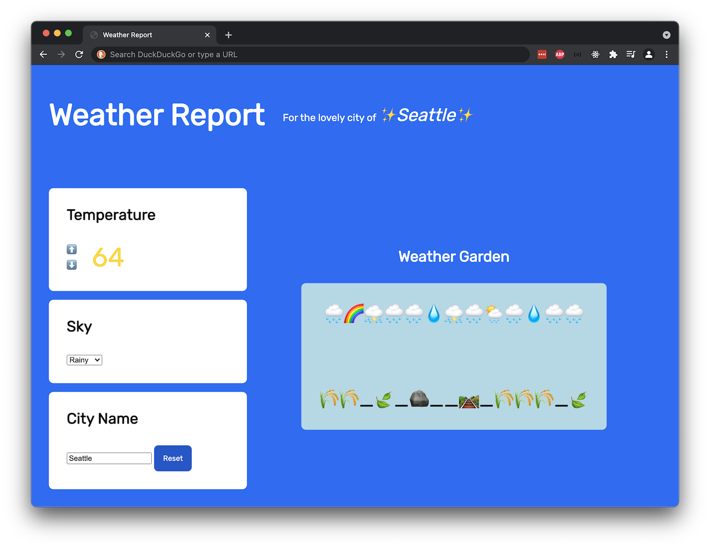

# Weather Report

## Skills Assessed

- Following directions and reading comprehension
- Structuring content in HTML
- Applying styles with CSS
- Using variables
- Creating functions
- Manipulating the DOM
- Handling events
- Using Git
- Designing an intentional user experience

## Goal

"Do I need to bring a jacket?" "Will it snow today?" "How hot will it be?" When we have questions like these, we often pull open a weather app!

Great weather apps do these two things:

1. Pull weather data from a data source
1. Display the weather in readable, compelling way

  
_Fig. DuckDuckGo's weather modal, which features city name, temperature reading, and the weather. Some icons show sunny weather, some icons show rainy weather, and some show cloudy weather._

Our goal is to create a fun, small weather app that focuses on displaying the weather.

Instead of getting weather data from a data source, we will set the weather using user interaction.

  
_Fig. Example weather app: The temperature reads 71, in orange text. The selected dropdown for "Sky" is "Cloudy." There is a depiction of cloudy weather. The city name is "My Hometown." The header reads "My Hometown."_

  
_Fig. Example weather app: The temperature reads 98, in red text. The selected dropdown for "Sky" is "Sunny." There is a depiction of sunny weather. The city name is "it's hot outside." The header reads "it's hot outside."_

  
_Fig. Example weather app: The temperature reads 32, in teal text. The selected dropdown for "Sky" is "Snowy." There is a depiction of snowy weather. The city name is "Happyville." The header reads "Happyville."_

  
_Fig. Example weather app: The temperature reads 64, in yellow text. The selected dropdown for "Sky" is "Rainy." There is a depiction of rainy weather. The city name is "Seattle." The header reads "Seattle."_

## How to Complete and Submit

Follow the requirements below and build a small weather app.

At submission time, no matter where you are, submit the project via Learn.

## JavaScript Requirements

You are required to use vanilla JavaScript for all parts of this project, including the optional enhancements.

Do not load or use any extra JavaScript libraries.

## Workflow Requirements

- Create at least five git commits throughout this project
- Use the following files and folders:
  - `index.html`
  - `scripts/index.js`
  - `styles/index.css`
  - `assets` folder, potentially for holding images
- Create and add more folders and files as needed

## Content Requirements

For this project, there are no requirements around color schemes, font choices, or layouts.

However, _at a minimum_, your project must contain these elements:

Wave 2:

1. An element that displays the temperature
1. A clickable element to increase temperature
1. A clickable element to decrease temperature
1. An element that displays a landscape

Wave 3:

1. A `<select>` dropdown element to set the sky type
1. An element that displays a sky

Wave 4:

1. An element that displays the city name
1. An element that contains a `<input type="text">` element, used to rename the city

Wave 5:

1. A clickable element to reset the city name

## Wave 1: Create Wireframes

Before writing code, create a set of diagrams, sketches, or low-fidelity wireframes to visualize your project's layout.

These wireframes should include all the required HTML elements.

If possible, share and talk through ideas with someone else!

Use these wireframes to guide the rest of your project.

### Tips

- This project will require you to select _a lot_ of elements. Creating logical, well-organized HTML structures in the beginning will help you later on.
- Create as many `id`s as you need. Sometimes, it's more effective to select by ID, compared to selecting by class, element, or relationship.

## Wave 2: Increase and Decrease Temperature

### Requirements

A numeric temperature must be displayed. This temperature can be in either Fahrenheit or Celsius degrees.

There must be two clickable elements:

1. An element that increases the temperature by one degree on click
1. An element that decreases the temperature by one degree on click

#### Temperature Ranges Change Text Color

Depending on what temperature it is, either:

- the temperature number changes color
- the background of the temperature changes color

There must be at least five categories of distinguishable colors.

Our solution uses the following ranges, which you may use if desired:

| Temperature (F) | Color  |
| --------------- | ------ |
| 80+             | Red    |
| 70-79           | Orange |
| 60-69           | Yellow |
| 50-59           | Green  |
| 49 or below     | Teal   |

#### Temperature Ranges Change Landscape

Depending on what temperature it is, a different landscape should appear on the page.

These landscapes can be anything, as long as they are visual and noticeable to any instructors. For example, the landscapes can be:

- A single image that appears
- ASCII art
- Text

Changing landscapes should _replace_ the existing landscape. There should only be one visible landscape at a time.

There must be at least five landscapes.

Our solution uses the following ranges, which you may use if desired:

| Temperature (F) | Landscape                         |
| --------------- | --------------------------------- |
| 80+             | `"🌵__🐍_🦂_🌵🌵__🐍_🏜_🦂"`       |
| 70-79           | `"🌸🌿🌼__🌷🌻🌿_☘️🌱_🌻🌷"`      |
| 60-69           | `"🌾🌾_🍃_🪨__🛤_🌾🌾🌾_🍃"`        |
| 59 or below     | `"🌲🌲⛄️🌲⛄️🍂🌲🍁🌲🌲⛄️🍂🌲"` |

## Wave 3: Selecting the Sky

There must be a [`<select> element`](https://developer.mozilla.org/en-US/docs/Web/HTML/Element/select) that lets users to determine what sky to display.

### Selection Changes Sky

When a user selects an option from the dropdown element, the appropriate sky should appear on the page.

Like the landscapes, the skies can be anything, as long as they are visual and noticeable to any instructors. They can be images, ASCII art, text, or anything else.

Like the landscapes, changing the sky should _replace_ the existing sky. There should only be one visible sky at a time.

There must be at least four skies.

Our solution uses the following sky options, which you may use if desired:

| Option | Sky                           |
| ------ | ----------------------------- |
| Sunny  | `"☁️ ☁️ ☁️ ☀️ ☁️ ☁️"`         |
| Cloudy | `"☁️☁️ ☁️ ☁️☁️ ☁️ 🌤 ☁️ ☁️☁️"` |
| Rainy  | `"🌧🌈⛈🌧🌧💧⛈🌧🌦🌧💧🌧🌧"`          |
| Snowy  | `"🌨❄️🌨🌨❄️❄️🌨❄️🌨❄️❄️🌨🌨"`       |

### Hints

- The event for changing a `<select>` element is not called `"click"`! You'll need to find the correct name for this event.
  - "html select change event" is a reasonable Internet search to start.
- This feature requires you to research how do you get the _value_ of the `<select>` element.

## Wave 4: Naming the City

As mentioned before, there are two required elements:

- An element that displays a city name
- A [text input element](https://developer.mozilla.org/en-US/docs/Web/HTML/Element/input/text) that allows the user to change the city name

### Requirements

The city name must update every time there's a change to the text input element.

For example, if the text input element has the characters `Seatt` in it, then the displayed city name should be "Seatt."

### Hints

- This feature requires you to grab the _value_ of the text input element.

## Wave 5: Resetting the City Name

Include a button that resets the city name.

When a user clicks on this button, the city name will be set to a default name.

### Hints

For best results, this reset button should also affect the city name text input element.

For the best user experience, the text input element's value should be set to the default city name, or become blank.

## Optional Enhancements

[Click here to visit a page of optional enhancements to inspire you.](ada-project-docs/optional-enhancements.md)
